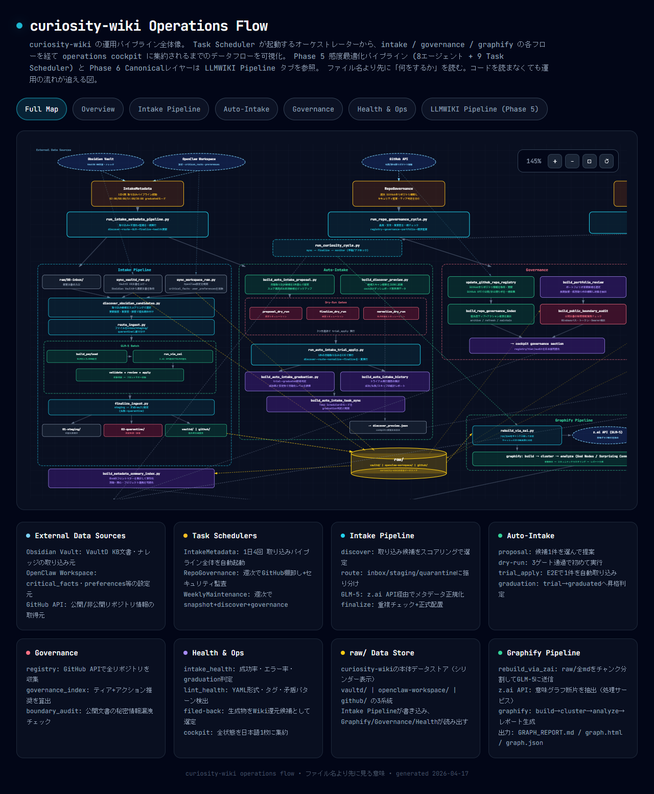

## Hi there

I’m an AI Engineer focused on agent operations, knowledge operations, and automation reliability.

I build automation systems and LLM/agent workflows that are not only functional, but also operable, monitorable, and maintainable in real-world environments. My specialty is tying tools, workflows, and repositories together into automation that doesn’t break.

---

### Featured: curiosity-wiki Operations Flow

End-to-end view of the operations pipeline for a personal LLM Wiki.
Visualizes the data flow from a Task Scheduler-triggered orchestrator, through the intake / governance / graphify flows, down to the operations cockpit.

**Live demo:** https://curiosity-wiki-ops.vercel.app

- 8-agent sensitivity-optimized pipeline (Phase 5)
- Concept normalization + alias resolution via a canonical layer (Phase 6)
- Automated intake 4x/day + weekly governance + daily meta supervision
- Multi-source search chain across Grok 4 / Perplexity / xAI API
- Multi-model orchestration with GLM-5 × Claude Code × Codex

The main repository is private. Only the visualization HTML is carved out into a standalone deploy repository and published via Vercel.

---

### Representative Projects

- **curiosity-wiki** — track-aware research and knowledge operations system for AI-agent-friendly workflows  
  Demo: https://curiosity-wiki-ops.vercel.app
- **openclaw-claude-bridge** — bridge-oriented orchestration for multi-agent execution and operational routing  
  Repo: https://github.com/Tenormusica2024/openclaw-claude-bridge
- **vault-d** — metadata normalization and knowledge structure design for durable AI workflows  
  Repo: https://github.com/Tenormusica2024/vault-d

### Selected Artifacts

- **curiosity-wiki Operations Flow (live demo)**  
  https://curiosity-wiki-ops.vercel.app
- **openclaw-claude-bridge**  
  https://github.com/Tenormusica2024/openclaw-claude-bridge
- **vault-d**  
  https://github.com/Tenormusica2024/vault-d
- **Portfolio** — personal portfolio site showcasing selected projects, AI workflow work, and implementation context  
  https://github.com/Tenormusica2024/portfolio

---

### Stack

- **Languages:** Python, TypeScript, PowerShell, Bash
- **AI / Agents:** Claude Code (Opus / Sonnet), Codex (GPT-5.4), GLM-5, Grok 4
- **Automation:** Task Scheduler, GitHub Actions, Vercel, Cloud Run
- **Knowledge Ops:** Obsidian Vault, frontmatter metadata, semantic graph (graphify)
- **Orchestration:** Claude in Chrome (CiC), Playwright CLI, dev-browser, MCP servers

---

### Focus

- Agent operations and AI workflow reliability
- Knowledge operations and agent-friendly structure design
- Cost-aware model routing and role separation
- Safe automation that reduces manual routing and repetitive judgment
- Guardrails, monitoring, and handover for real-world operation
